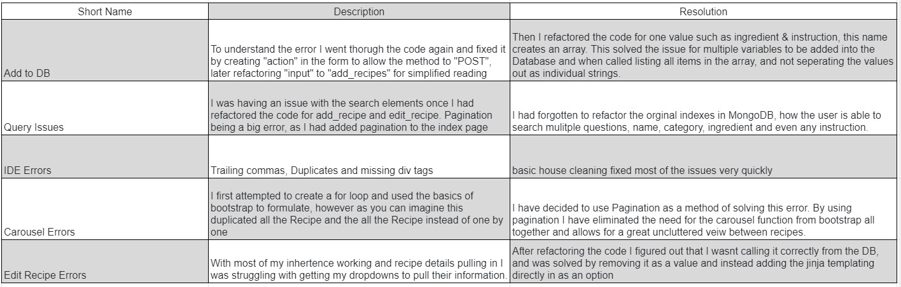
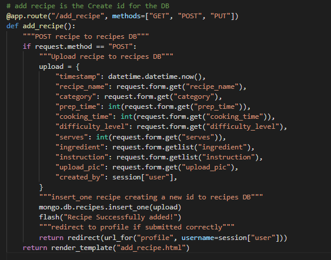
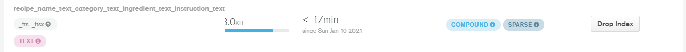
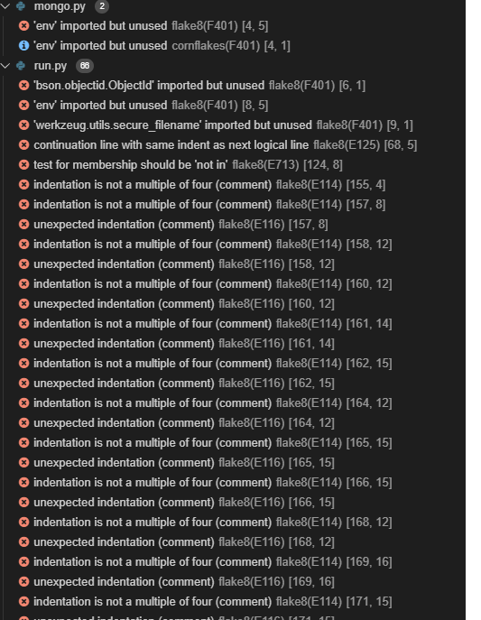
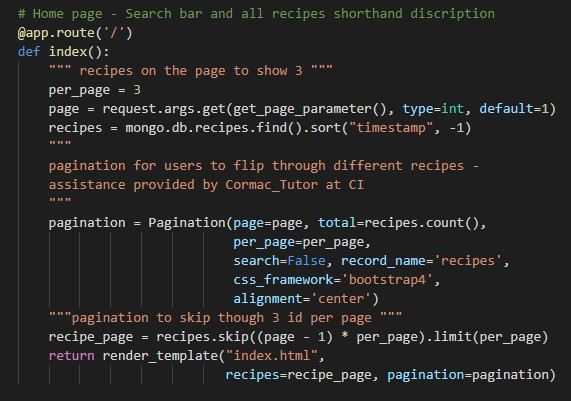
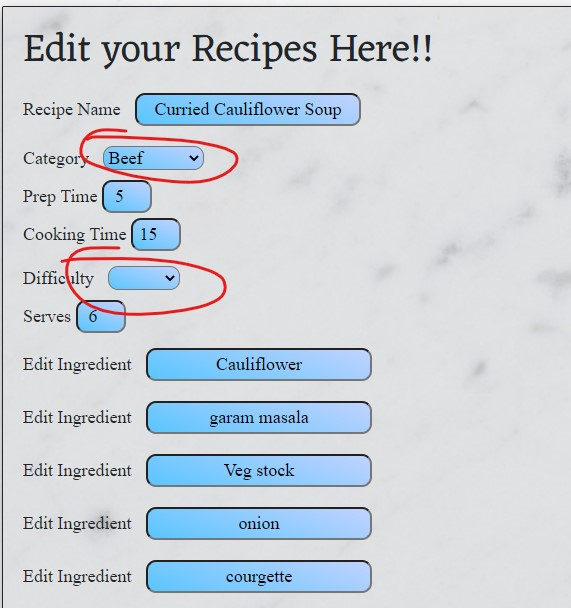

---
# Recipe Cloud Errors #
---
* [DB Build Errors](#DBErrors)
* [Query Issues](#QueryIssues)
* [IDE Errors](#ideErrors)
* [Carousel Errors](#CarouselErrors)
* [Edit Recipe Errors](#EditErrors)

---
**During development**
---
As I had afew learning curves by using Python frameworks there was alot of errors I needed to work through and understand, I wanted to document a lot of my learning opportunities through this project.

---
## Errors & Issues ##
---

---

### DB Build Errors ###
---

* I had a major issue with my MongoDB file whilst setting up the database because of this issue:  

**Issues**

I did not understand what was going on as my form was good and allowing me to add into the fields,  however when I submitted it was not sending it to the
database and saving it in the collections?

* To understand the error I went thorugh the code again and fixed it by creating "action" in the form to allow the method to "POST", later refactoring "input" to "add_recipes" for simplified reading 
* Then I refactored the code for one value such as ingredient & instruction, this name creates an array. This solved the issue for multiple variables to be added into the Database and when called listing all items in the array, and not seperating the values out as individual strings.  
* I also refactored the uppercase to lowercase, plurals and used_ to_seperate the variables wording rather. I refactored the numerical data into Intergers by using the int() option in python.  
* I also added timestamps and created_by to reference when the user is logged on, timestamps to allow the users to see the latest recipe added and created_by for users to veiw all their own recipes in their profile.  

---

### Query Issues ###
---

I was having an issue with the search elements once I had refactored the code for add_recipe and edit_recipe. Pagination being a big error, as I had added pagination to the index page.

* After many attempts I decided to rather add a seperate html dedicated to search results instead trying to forced the system to display the index page.  
* Once fixed the search was not bearing any results, very confused as no errors were appearing. Thus I assumed the issue must lie with the query.  
* And yes, I had forgotten to refactor the orginal indexes in MongoDB, how the user is able to search mulitple questions, name, category, ingredient and even any instruction.  

---

### IDE Errors ###
---

I also has few errors passing through my GitPod, basic house cleaning fixed most of the issues very quickly

---

### Carousel Errors ###
---

* I first attempted to create a for loop and used the basics of bootstrap to formulate, however as you can imagine this duplicated all the Recipe and the all the Recipe instead of one by one
* Then I tried to slice off 3 to see if that would work this was the closest I got in making it work unfortunately I had to abandon the idea for the time being due to time constraints.
* I have been thinking of solving this error by using pagination and carousel together.
* Eventaully abandoning the carousel for only pagination.

---

### Edit Recipe Errors ###
---

* With most of my inhertence working and recipe details pulling in I was struggling with getting my dropdowns to pull their information.
* After refactoring the code I figured out that I wasnt calling it correctly from the DB, and was solved by removing it as a value and instead adding the jinja templating directly in as an option

