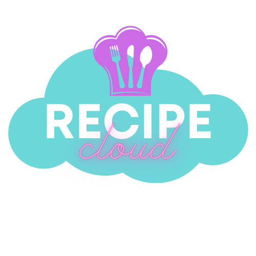
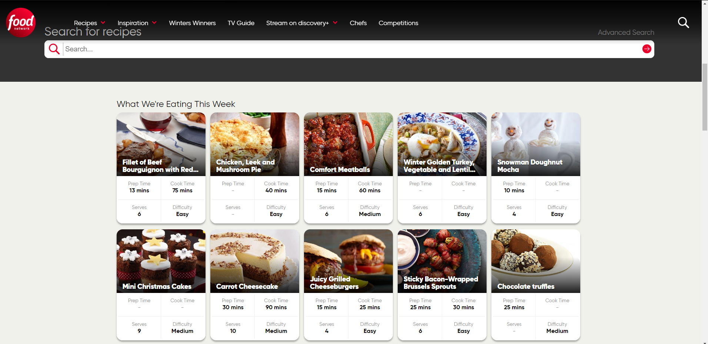
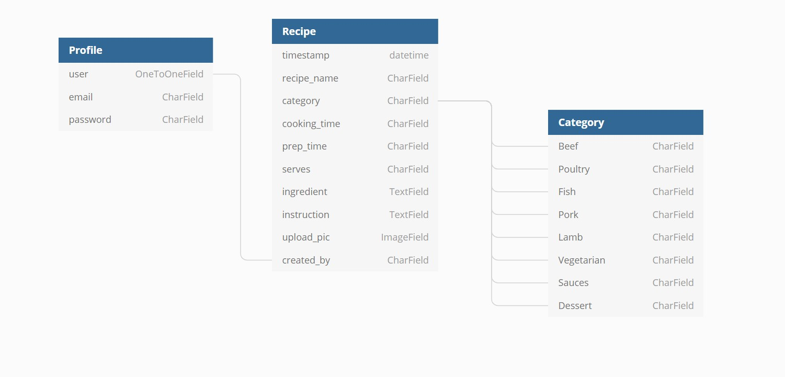
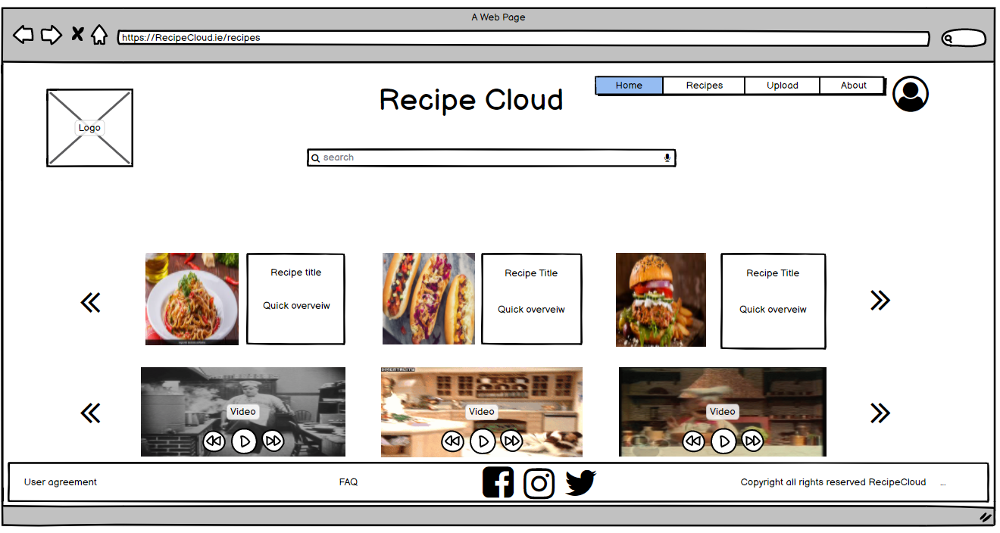
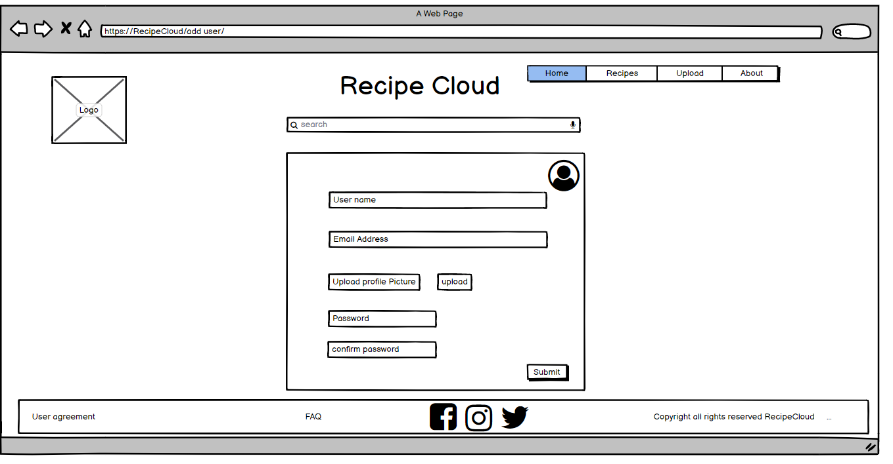
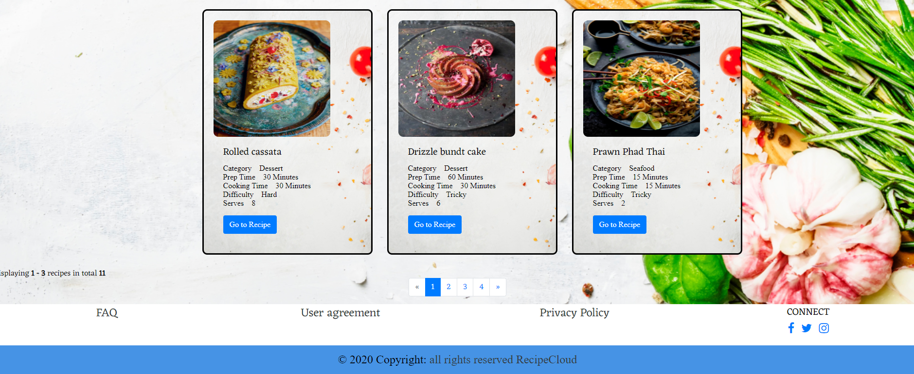
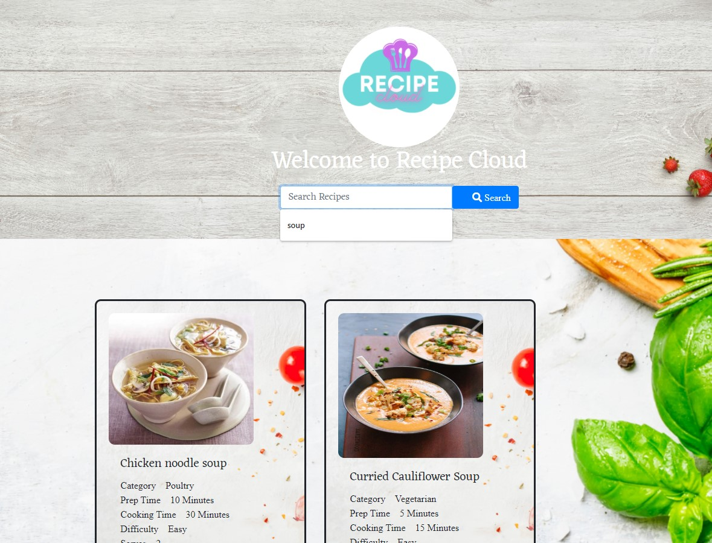
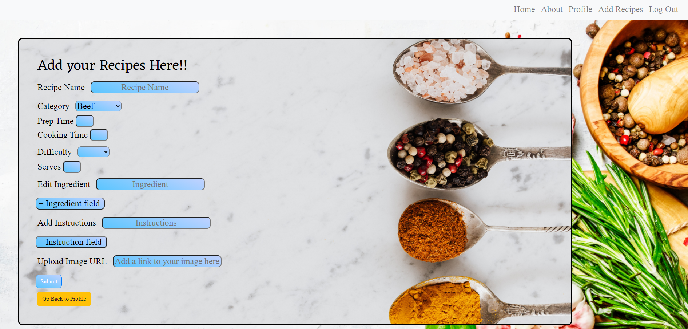
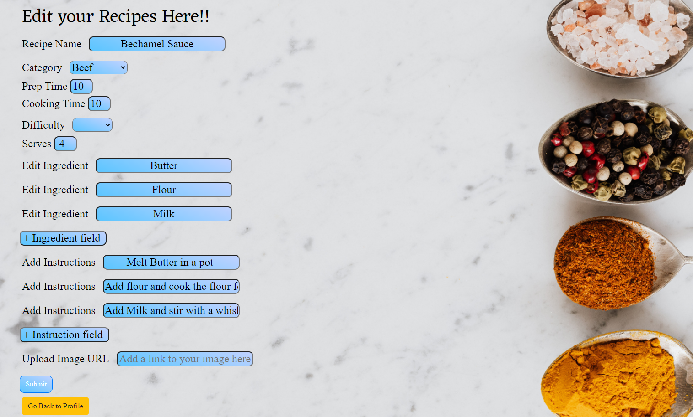
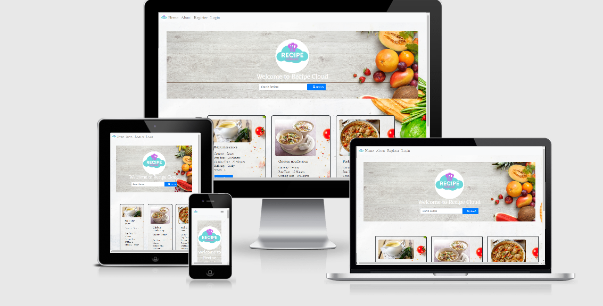

---
# Recipe Cloud #
---

---
## Contents ##
---

* [UX](#User-Experience)
    * [Project Goals](#project-goals)
    * [User Goals](#user-goals)
    * [User Stories](#user-stories)
    * [Research](#requirements)
    * [Design Choices](#design-choices)
        * [Fonts](#fonts)
        * [Icons](#icons)
        * [Colors](#colors)
* [Structure](#structure)
    * [Page Structure](#page_structure)
        * [Home Page](#home_page)
        * [Browsing](#browsing)
        * [Detailed View](#detailed_view)
    * [Database and schema](*db_schema)
        * [Schemas](*schemas)
        * [Database](*db)
    * [Wireframing](#wireframing)
    * [Design and Layout](#design)
* [Features](#features)
    * [Features that have been developed](#developed)
    * [Features that will be implemented in the future](#implemented)
* [Technologies](#technologies)
* [Testing](#testing)
    * [Responsiveness](#Responsiveness)
* [Troubleshooting](#issues)
* [Deployment](#deploy)
* [Credit](#credits)

---
---

## UX (User Experience) ##
---
---

### Project Goals ###
---

The are many places on the internet to find recipes but their are not many that allow you to add your own recipes to swap and share 

The **goal** for this project is to to recreate a neighbourhood profile where friends, neighbours and relatives can swap and share their favourite recipes, simply and easily. 
A safe space to find inspiration with the items already in their fridge.

---

### User Goals ###
---

For the UX on this project I wanted to create a simple and user friendly site. My target audience is young and mature adults.  
The site also allows for Profeesional Chefs to share some of thier awards winning recipes but also for the student to swap their 
quick fixes even grandmas can leave their family recipes down for everyone to enjoy!!

* **Testing his/her/their Cooking abilites** with **quick searches** within the **Category** they are looking for.
* **Being excited** to find new recipes and **share** their own.
* Get a **inspiration** for cooking out of the box.
* **Keep adding more and more recipes** to the website **again & again**.
* **List their own Recipes** and **favourite** recipes to go to **time & again**

For the UX on this project I wanted to create a simple and user friendly site. My target audience is young and mature adults.  
The site also allows for restaurant customers to find good and decent Recipes in their area!!

#### Scope ####
* An Eye catching landing page
* Mass-displaying all or filtered Recipes. Lines of relatively small images, with option to click and view or like
* Search Recipes.
* Detailed profile for up and coming chefs on top of the simple registration.
* Dedicated page for uploading new Recipes
* Full page Deal view including the Name of the Recipe, Cooking details with Ingredients and Instructions
* Legal framework is also included, with links to privacy policies and FAQs, as well as corporate info in the about us section of the website.

#### Registered Users ####
* **View specific Recipes** with **quick searches** within the **Category** they are looking for, instead of sifting through all the Recipes.
* **Being excited** to find new Recipes and **share** these Recipes with their friends.
* **View** the full list of Recipes on the home page
* Easily **Register & Create** a Profile, having a User specific profile.
* Easily **Login or Logout** access to account information
* **Add, Edit and Delete** Company information as needed in a **personalized User profile**
* **Add, Edit and Delete** Recipes periodically

#### Out of Scope topics ####

* Potential further features:

    * Easily **recover my password** in case I forget it.
    * filter and sort Recipes.

* Marketing the site itself and utilising advertising opportunities within the site is out of scope, therefore the links to social media sites are merely links for users to go to thier own profiles to share their recipes.

---

### User Stories ### 
---

* The **user** wants an **attractive website** with a **non-distracting** background.
* The **user** wants to see **clear instructions** on how to add recipes to the website.
* The **user** wants there to be a **search box** so that the user can quickly identify **recipes**.
* The **user** wants to be able to **search** categories or ingredients.
* The **user** wants to be **challenged** in his/her/their **skills**.
* The **user** wants to know the **difficulty** of the recipe before **deciding**.
* The **user** wants to start **finding recipes immedaitely**. 
* The **user** wants to see the **latest recipes** added.
* The **user** wants a **conveint sized recipes box** to be able to read the recipe clearfully.
* The **user** wants to know the **recipe** details such as **ingredients, method and cooking instructions**
* The **user** wants to **have the possibility** of thier **own profile** where their recipes come up first.
* The **user** wants to **have the possibility** of **favorites** where their best recipes are **saved for later**.
* The **user** wants to **know** if **their recipe has been submitted**.
* The **user** wants to **easily add their own recipe** to the website.
* The **user** wants to **have the possibility** to **upload pictures**.
* The **user** wants to get a maximum of advantage of the **recipe cloud**.

---

### Research ###
---

* When developing this **website**, I kept in mind that the aesthetic should be inspired by similar Recipe hubs on the internet. 
* I tried to create a **simple and easy feel** to for a cleaner approach for the landing page.
* I checked **previously made recipe websites** such as [**foodnetwork.co.uk**](https://foodnetwork.co.uk/) and used **my own experience** as a trained chef. 
* I tried to create a **simple and easy feel** to for a cleaner approach for the landing page.

---

### Design Choices ###
---

### Fonts ###

* The **landing page** is using the classic website **Google Fonts** **#** for the H1 and H3. 
* I paired it with the **Google Fonts** **Eczar & SpicyRice** for readability.
* I kept the **SpicyRice** font for **better user experience**

### Icons and Images ###

* The **Favicon** used on the website are provided by [**Canva**](https://canva.com/) and called by using url_for.
* The **image** used for the **landing page** is a created **image** from the image bank [**Canva**](https://canva.com/). 
* Extra **background images** (https://google.com/) with a simple research with the keyword **cooking and baking**.

### Colors ###

* The **color scheme** used for the website is a sleek **recipe website palette** composed of a combination of **black and whites** for the **title** and a **classic light teal** for calming affect for the **logo** on the **a sky blue with neon type writing** .

---
---

## Structure ##
---
---

### Page Structure ###
---

#### Home page ####

There are two types of users and I wanted to give a clear path to start using the site with Call To Action for both groups. Potential deal shoppers are directed to the Search & browsing, while potential restuaranteurs are shown an eye-catchy banner with a popping CTA button.

#### Browsing ####

Many similar sites (competitors) are trying to showcase a wide range of services and options, therefore losing focus and probably losing potential subscriptions and users by not inviting them to further explore the site. My clear goal here is to lead users to check out more Recipes for dining and eating out.

#### Detailed view ####

Clicking on any of the Recipes on the home page brings the user to the deal details page, displaying all the available information about each deal. 

#### Potential contributors ####
Potential contributors have a flow of action to fully utilize the page and achieve their goals. They have a strictly limited access to the part of the database that concerns their artwork and therefore can perform CRUD operations.

* Create new entry: upload image and provide details
* Read (Display) entries - the detailed view with personal information
* Update entries - making changes to their existing records
* Delete entries – delete items from the database 

---

### Database and schema ###
---
I put quite some emphasis into designing the database structure and schema. I wanted to keep it simple and easy for other developers to understand

#### Schemas ####

The steps and outcome was as follows (note that the final structure differs at several points, because I had to adjust on multiple occasions):

Identifying Entities:
* User
* Restaurant User
* Deal
* Deal Image
* Deal Description
* Prices
* Contact Details to make bookings such as Address, Phone Number and Websites
* Subscriptions

Identifying Relationships
* Recipe_ID = Categories = User = Timestamps

For **data schema** I used the tool [**dbdiagram.io**](https://dbdiagram.io/home).

href = https://dbdiagram.io/d/6062e509ecb54e10c33de7be

#### Database ####

Recipes are more understandable for other developers. 

Profiles:
* Username
* Email
* Password

Recipes:
* Timestamp
* Recipe Name
* Category
* Cooking time
* Prep time
* Serves 
* Ingredient
* Instruction
* Upload Pic
* Created By

Categories:
* Beef 
* Poultry
* Fish
* Pork
* Lamb
* Vegetarian
* Dessert
* Sauces

---

### Wireframing ###
---

For **wireframing** I used the tool [**Balsamiq**](https://balsamiq.com/).

Please follow the link to find the preview [here] 

href = https://balsamiq.cloud/srsmfvs/pt96bgn/r7C4D

* Herewith the **wireframe** and I pushed a few changes for better readability and engagement:
* I added **a jumbotron hero image** on the landing page.
* I added **a full-screen background image** on all the other pages.
* I used a **form** to allow for the user to add & edit recipes.
* I added an easy link to **upload** videos.

### Landing Page ###

### Recipe Menu ###

### Video Page ###

### Add User Page ###

### Add Recipe Page ###

---

## Design ##
---
Even though the design is responsive, because of the obvious reasons, a service like this is less likely to be used on small mobile devices. Therefore only desktop versions of the different design elements are shown here.

#### Landing page: ####

Heading 

Footer

#### Search Bar: ####

#### Recipe Detail page: ####

#### Sign up page: ####

#### Log In page: ####

#### NavBar Dropdown: ####
* Before Login or Sign Up

* Client Logged in successfully

* IF SuperUser 

#### Profile page: ####

#### Add a Recipe page: ####

#### Edit a Recipe page: ####

#### Delete message: ####

#### About Us page: ####

#### Privacy Policy page: ####

#### Terms & Conditions page: ####

#### IamResponsive: ####

---
---

## Features ## 
---
---

### Implemented Features ###

* **Responsiveness** on all screen sizes.
* **large title** for attractiveness and engagement.
* **Suggested recipes** on landing page as an introduction.
* **User login/logout** so that users can keep a tally of their own recipes added and videos uploaded.
* **Input Recipes** to the website.
* **Edit Recipes** to the website.
* **Search Recipes** on the Website.
* **Instructions** so that the user can grasp the concept immedaitely.
* **Immedaite** recipes with Easy and simple instructions to make the recipe.
* **Download success** notation when recipe has successfully saved to the database
* **upload picture** with the recipe to give people a sense of what can be acheived with their recipe.
* **upload video** allows users to upload videos of themselves creating a recipe.

* **Responsiveness** on all screen sizes.
* **large title** for attractiveness and engagement.
* **Suggested Recipes** on landing page as an introduction.
* **User login/logout** so that users can keep a tally of their own Recipes added and videos uploaded.
* **Input Recipes** to the website.
* **Edit Recipes** to the website.
* **Search Recipes** on the Website.
* **Instructions** so that the user can grasp the concept immediately.
* **Immediate** Recipes with Easy and simple instructions to make the Recipes.
* **Download success** notation when Recipes has successfully saved to the database
* **upload picture** with the Recipes to give people a sense of what can be achieved with their Recipes.
* **upload video** allows users to upload videos of themselves creating a Recipes.

### Future implemented features ###

* **Feature 1** - **Rating system** for others to be able to rate the recipe success.
* **Feature 2** - **Comment box** and **messages notifications** below the recipes for users to interact with each other.
* **Feature 3** - **Favorites** for user to quickly reference recipes they enjoyed or still want to Experiment with.
* **Feature 4** - **Input Videos** to the website.

---
---

## Technologies used ##
---
---

* [HTML](https://developer.mozilla.org/en-US/docs/Web/HTML)
* [CSS](https://developer.mozilla.org/en-US/docs/Web/CSS)
* [Javascript](www.javascript.com)
* [JQuery](https://jquery.com/)
* [Python](https://www.python.org/)

**Tools & Libraries**

* [Bootstrap](https://getbootstrap.com/)
* [Font-Awesome](https://fontawesome.com/icons?d=gallery)
* [Google fonts](https://fonts.google.com/)
* [Git](https://git-scm.com/)
* [PNGtree](https://PNGtree.com/)
* [Flask](https://pypi.org/project/Flask/)
* [Canva](https://canva.com)
* [MongoDB](https://cloud.mongodb.com/)

* [Bootstrap](https://getbootstrap.com/)
* [Font-Awesome](https://fontawesome.com/icons?d=gallery)
* [Google fonts](https://fonts.google.com/)
* [Git](https://git-scm.com/)
* [Balsamiq](https://balsamiq.com/)
* [dbdiagram](https://dbdiagram.io/)
* [Heroku](https://www.heroku.com/)
* [django-extensions 3.1.1](https://pypi.org/project/django-extensions/)
* [Canva](https://canva.com)
* [pip3](https://pip.pypa.io/en/stable/installing/)

**Framework & Extensions**

* dj-database-url - allows use of environment variable for database connections
* bootstrap 4 - a mobile friendly CSS framework based on a responsive grid system. Provides out of the box UI components such as navigation menu bar, carousels, and cards.
* django-bootstrap4 - Bootstrap 4 integration for Django
* django-crispy-forms - Allows style and HTML control of Django template form displays
* django-forms-bootstrap - allows further customization of bootstrap forms within Django framework
* stripe - A python library to talk to Stripe's API
* boto3- allows Python to talk to AWS SDK so you can store data in S3 buckets
* coverage - measures and analyzes code coverage of python code
* django-storages - a collection of custom storage backends with django to work with * boto3 and AWS S3.
* django-multiselectfield - allows checkbox display of multi selects for django
* graphviz -used to create graphics from Python
* django-extensions - collection of management commands for django, used for validating templates, and graphics for models
* gunicorn - Python WSGI HTTP Server for UNIX so you can host your application
* pillow -Python Imaging Library to help store imagery into a database
* psycopg2 - PostgreSQL database adapter for the Python

**APIs**

* AWS S3 Bucket - allows seamless uploading of user files to cloud storage using application credentials
* stripe - payment platform to validate and accept credit card payments securely

### Defensive Programming ###

Sites with ownership rules and roles opens a site up to hacking especially if your users are savvy and notice url parameters correlate to database object manipulation. Django is pretty good, allowing you to hook in login required for views associated with CRUD options, and form validation is top notch if you define it yourself.

**Additional Security Checks**

1. Users cannot Delete or Update other's submissions. The Deal Delete and Deal Update views check for Entry Id's to prevent logged in users from guessing the ID of a peer's login
2. Users cannot Update or Delete others' Recipes. 
3. Users cannot Update profiles for other users. The Profile Update view checks the user's id against the logged in user's id before allowing updates.
4. Users cannot Update User Information for other users. The User Update view checks the user's id against the logged in user's id before allowing updates.
5. Users cannot Checkout and enter a payment unless they are logged in and payments cannot be attributed to other profiles.
6. Changing passwords requires sending a registered email link and does not auto log in a user. While it's annoying to have to wait for a password reset email, then to login after setting it, this step prevents users from taking account ownership over if they manipulate a password reset for their account and attempt to hack another's and it leads to better retention of the password.

**Custom Validation**

1. User Registration and User information Updates
    * Emails and usernames are unique to the system, the same user name cannot be used by another person likewise for the email address.
2. Recipes
    * Recipes end dates must be in the future for creation and updates
3. Account Management
    * when a user updates their username or email, the system is cross checked for uniqueness of values

---
---

## Testing ##
---
---
Validation, manual unit, cross browser/cross device, accessibility, travis, coverage, this app has a dash of everything test related. See the separate [TESTING.md](TESTING.md) file for the details.

### Responsiveness ###

* **Implementation** 

    * I used **Bootstrap** as well as **flexbox and custom CSS media queries** to ensure that the website didn't break on all screen sizes.

**Landing Page**

* **Implementation** 

    * I wanted to keep it clean and neat with the landing page displaying the newest and latest Recipes. 
    * The UI has been created in HTML5 and CSS3 and by using bootstrap all tiles are responsive on all screen sizes. 
    * User does not have to register if they just want to View Recipes all Recipes are free to View. 
    * Landing page was responsive and working as expected 

**Add register**

 

* **Implementation**

    * To start adding your own Recipes you would need to register. 
    * Once registered you would have to log in 
    * User is informed if registration is successful if flash message appears "user successfully added" else flashes "user name already used" 
    * Register and Log-in page was responsive and working as expected 

**Profile for members and admin**

 
 

* **Implementation**

    * This is where the real fun begins, as a user you can  
        1. Their **own Recipes** where their Recipes come up first.  
        2. **Easily Add and Edit their own Recipes** to the website.  
        3. **Have the possibility** to **upload pictures**  
        4. **Easily Delete their own Recipes** if they no longer want to be on the website.  
    * Profile page was responsive and working as expected 
     * This is where the Admin can see all the listings page 
        1. Admin also has their **own profile** where their Recipes come up first.  
        2. From Listings Admin can **Easily Add and Edit all Recipes** on the website.  
        3. **Have the possibility** to edit **upload pictures** which do not subscribe to the user agreement on the page  
        4. **Easily Delete any Recipes** if the deal does not prescribe to the user agreement and is no longer allowed on the website.  

**Add Recipes & Edit Recipes**

 
 

* **Implementation**

    * Both the add_Recipes and the edit_Recipes, have the same framework and based on the same template.  
    * edit_Recipes does however pulls all the values from the DB so that User is aware what deal they are editing  

    * This is the second step of the **CRUD** functionality, users can Add or edit the following:  
        1. Restaurant name
        2. Category 
        3. Number
        4. Address 
        5. Website 
        6. Recipes name 
        7. Description 
        8. Price
        9. Image
        10. User

    * Also I have added a button for the user to change their mind and go back to profile.  
    * add_Recipes and the edit_Recipes pages was responsive and working as expected 

---
---

## Troubleshooting ##
---
---

As I had a few learning curves by using Django frameworks there were a lot of errors I needed to work through and understand, I wanted to document a lot of my learning opportunities through this project. See the separate [ERRORS.md](ERRORS.md) file for the details.

---
---

## Deployment ##
---
---

This application can be run locally or deployed to a live environment. Directions are provided for deploying to Heroku.

### Requirements ###
If any of the following are unfamiliar, please click on their associated links as they are necessary when setting the environmental variables required to run this application:

* an IDE such as GITPOD - a tool to help develop software
* PIP - coordinates python installation packages
* python 3 - Python is a programming language that lets you work more quickly and integrate your systems more effectively.
* git - version control system for code source
* a gmail account with less secure app access turned on use this link after you are signed into the gmail account - allows system to send email notifications such as password reset and user registration links
* a stripe account - used to securely collect payments, testing API's level is fine unless you want collect payments for real
* AWS-S3 (Amazon Web Services - Simple Storage Storage Account) - web based cloud storage service for online backup of website assets
* S3 Bucket - a cloud storage resource which is similar to file folders on a computer's hard drive

## Local ##

1. Save a copy of the github repository located at https://github.com/Justwhittaker/PRO3-RecipeCloud - master by clicking the 'download.zip' button at the top of the page and extracting the zip  file to your chosen folder. If you have Git installed on your system, you can clone the repository with the following command:

$ git clone https://github.com/Justwhittaker/PRO3-RecipeCloud.git - master

2. Open your preferred IDE, then open a terminal session in the unzip folder or cd to the correct location.

3. Set up a virtual environment via this command in the terminal session:

    * python3 run.py
    
4. Activate the .venv with the command:

    * .venv\Scripts\activate
    * Again this command may differ depending on your operating system, please check the Python Documentation on virtual environments for further instructions.

5. If needed, Upgrade pip locally with:

    * pip install --upgrade pip

6. Install all required modules with the command:

    * pip install -r requirements.txt

7. Create a new file at the base RecipeCloud directory level called env.py:

    * touch env.py

8. Copy the following into the env.py file:

    * import os

    * os.environ.setdefault('HOSTNAME', '<your value>')
    * os.environ.setdefault('SECRET_KEY', '<your value>')
    * os.environ.setdefault('EMAIL_USER', '<your value>')
    * os.environ.setdefault('EMAIL_PASS', '<your value>')

9. Replace with the values from your own accounts

    * HOSTNAME - should be the local address for the site when running within your own IDE.
    * SECRET_KEY -is a Python secret key, a long random string of bytes. For example, copy the output of this to your config:
    * python -c 'import os; print(os.urandom(16))'

10. Create the superuser so you can have access to the django admin, follow the steps necessary to set up the username, email and password by running the following management command in your terminal:

    * python manage.py createsuperuser

11. Preload products. To match starter projects and user profile tags to the original concept, run the following commands from your IDE's terminal:

    * python manage.py loaddata db.json

12. Start your server by running the following management command in your terminal:

    * python run.py

### Heroku ###
To run this application in a cloud environment to allow visibility to external users, you can deploy the code to Heroku. If you wish to do the same, follow the steps below. Please note this section assumes you have succeeded at running the application in your local environment first.

1. Login to Heroku and set up a new app with a unique name (something like <yourname>-recipe-cloud-pro)

2. Go to the Settings tab, click Reveal Config Vars and copy the DATABASE_URL value into your local memory.

3. In your IDE, open the env.py file add the following line to the file and paste in your DATABASE_URL value:

    * os.environ.setdefault('DATABASE_URL','<your DATABASE_URL value>')

4. In heroku for your newly created app, go back to the Settings tab, and click Reveal Config Vars. This time you will be copying the values from your env.py file into heroku. Make sure you load following:

5. Because this is a new database, you will to set up the databases by running the following management command in your terminal:

    * python manage.py migrate

    * If you restart your machine to activate your environment variables, do not forget to reactivate your virtual environment with the command used at step 4.

7. Create the superuser for the postgres database so you can have access to the django admin, follow the steps necessary to set up the username, email and password by running the following management command in your terminal:

    * python manage.py createsuperuser

8. Preload products and tags. To match starter projects and user profile tags to the original concept, run the following commands from your IDE's terminal:

    * python manage.py loaddata db.json
 
9. In the event packages have been updated, it's best to re-create the requirements.txt file using the terminal command prompt:

    * pip freeze > requirements.txt

10. Create a Procfile:

    * echo web: python run.py > Procfile

11. Add the files if they changed and push to git hub:

    * git commit add Procfile
    * git commit add requirements.txt
    * git commit-m 'getting ready to deploy to heroku'
    * git push -u origin

12. From the heroku dashboard of your newly created application, click on the "Deploy" tab, then scroll down to the "Deployment method" section and select GitHub.

13. Use the github linking and type in the name of the repository ex:) PRO3-RecipeCloud and click the search button. Then connect the heroku app to the desired GitHub repository.

14. On the Deployment Tab, scroll a bit further down to the "Manual Deploy" section, select the master branch then click "Deploy Branch".

15. If you have errors, look at the logs for your application, most common errors are forgetting to add the hostname and disabling collectstatic.

16. Once your application is running, you may want to update the Deployment method from Manual to Automatic.

---
---

## Credits ##
---
---

**Text Credits:**

No website can be created without the community resources found on the web. Searching stackoverflow and GeeksfoGeeks and reading blogs has helped create this site. A special note for the articles that solved specific issues vs syntax questions can be found in the acknowledgements section.

* All text content has been written by Justin Whittaker.

I received inspiration and technical knowledge for this project from the following platforms

1. Bootstrap  
* https://mdbootstrap.com/docs/standard/forms/input-fields/ 
* https://getbootstrap.com/docs/4.3/components/card/ 
* https://getbootstrap.com/docs/4.3/components/dropdowns/ 
* https://www.w3schools.com/bootstrap/bootstrap_ref_css_images.asp  
* https://www.w3schools.com/bootstrap4/bootstrap_navbar.asp  

2. MongoDB  
https://cloud.mongodb.com/  
https://towardsdatascience.com/using-mongodb-with-python-bcb26bf25d5d#9c71 
https://www.w3schools.com/python/python_mongodb_query.asp 
https://docs.mongodb.com/manual/reference/bson-types/ 
https://towardsdatascience.com/using-mongodb-with-python-bcb26bf25d5d#9c71 
https://www.w3schools.com/python/gloss_python_date.asp 
https://www.w3schools.com/python/python_mongodb_update.asp 
https://www.codementor.io/@arpitbhayani/fast-and-efficient-pagination-in-mongodb-9095flbqr 

3. Python research  
    1. CodeInstitute Python Fundamentals  
    2. https://randomkeygen.com/  
    3. Docstring conventions - https://www.python.org/dev/peps/pep-0257/  

4. Better Git Commit terms  
http://karma-runner.github.io/5.0/dev/git-commit-msg.html

5. Dependencies  
    1. PyMongo  
    2. JQuery (html js middleware)  
    The project uses JQuery to simplify DOM manipulation.  
    3. bootstrap  
    4. dnspython

6. Other platforms  
* https://policymaker.io/privacy-policy-ready/  
* https://favicon.io/favicon-generator/  
* http://ami.responsivedesign.is/#

7. Media sources for sample Recipes  
* 
* 
* 
* 
* 
* 
* 
* 

**Many thanks to:**

* My mentor **Ignatius Ukwuoma** for his patience and kindness
* **AudreyLL88** and **Malia** for their very inspiring ReadME
* **Code Institute Slack community** for the technical and emotional support
* **Code Institute Rockstar Tutors** Cormac, Jo, Mike, Tim, Sam, Johann and Milkos were fantastic help
* **Alishia Whittaker**, for the Graphic design and stock images from Canva and your support through all my studies

**Site for educational purposes only!**