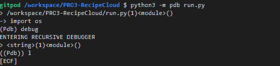
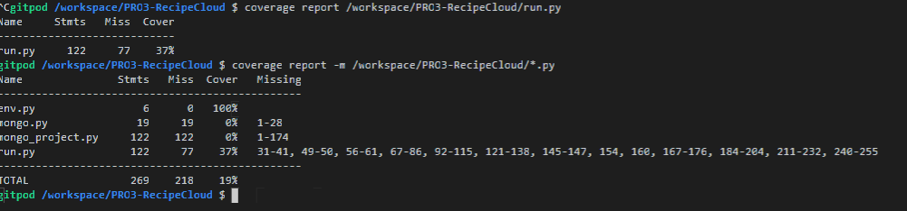
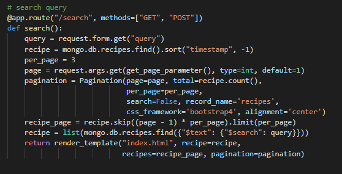
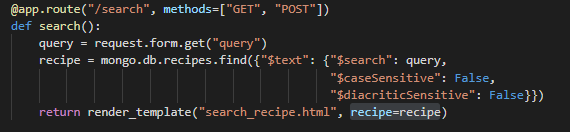
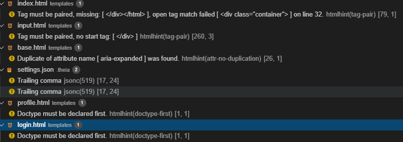

---
# Recipe Cloud Testing #
---
## Contents ##
---

* [Testing](#Testing)
    * [Validation Testing](#ValidationTesting)
    * [Unit Testing](#UnitTesting)
    * [Cross Browser/Cross Device Verification](#CrossBrowser)
    * [Python Tests](#PythonTests)
    * [Troubleshooting](#Troubleshooting)
    * [Outstanding Defects](#OutstandingDefects)

---

## Testing ##
---

---

### Validation Testing ###
---

*I used **pep8online.com** to test my Python code validator with no issues - http://pep8online.com/checkresult

* I tested the python code with **Python Debugger** - https://realpython.com/python-debugging-pdb/

* Also used this **Automated Testing** to test my flask applications - https://www.patricksoftwareblog.com/unit-testing-a-flask-application

* I tested the responsiveness of the website by using the [**Google Chrome Developer Tool**](https://developers.google.com/web/tools/chrome-devtools) as well as the plug-in **Unicorn Revealer** to control my overflow and the website [**Am I Responsive**](http://ami.responsivedesign.is/). 

* I also tested my website on **different browsers and real devices** : **Iphone 6s, Ipad Pro 12", Ipad Mini, Google Chrome, Safari, Mozilla Firefox and Samsung A70.**
* I used a first **dirty version** of this project on **Gitpod** and **refactored** my code **step by step** to remove any **useless classes**
* I tested my CSS file and my HTML files using [**CSS Validator**](https://jigsaw.w3.org/css-validator/) and [**HTML Validator**](https://validator.w3.org/) then fixed the issues needed to be fixed.

* I tested every **functions** of my script.js using multiple **console.log** and checking for **errors** in the **Google Chrome console**.
* I passed my deployed app through **Lighthouse** with the follwoing results

* All pages passed the HTML,CSS and Python validator final test with no major issues.

* [**CSS Validator**](https://jigsaw.w3.org/css-validator/) - Note, any error associated with root: Imported style sheets are not checked in direct input and file upload modes were ignored.
* [**HTML Validator**](https://jigsaw.w3.org/css-validator/) - ran all files through the validator and also used gitpod's IDE to identify mismatched tags.
* [**JavaScript Validator**](https://beautifytools.com/javascript-validator.php) Note any errors for let, variables set in other .js files, and constants were ignored. 
* [**GitPod IDE**](https://gitpod.io/) - Gitpod has inline validation for many file types. Python, CSS, HTML, files were continuously tested for validity when using this IDE.

## Issues ##
---

**During development**

* I had a major issue with my MongoDB file whilst setting up the database because of this issue:  

**Issues**

I did not understand what was going on as my form was good and allowing me to add into the fields,  however when I submitted it was not sending it to the
database and saving it in the collections?

* To understand the error I went thorugh the code again and fixed it by creating "action" in the form to allow the method to "POST", later refactoring "input" to "add_recipes" for simplified reading 
* Then I refactored the code for one value such as ingredient & instruction, this name creates an array. This solved the issue for multiple variables to be added into the Database and when called listing all items in the array, and not seperating the values out as individual strings.  
* I also refactored the uppercase to lowercase, plurals and used_ to_seperate the variables wording rather. I refactored the numerical data into Intergers by using the int() option in python.  
* I also added timestamps and created_by to reference when the user is logged on, timestamps to allow the users to see the latest recipe added and created_by for users to veiw all their own recipes in their profile.  

I was having an issue with the search elements once I had refactored the code for add_recipe and edit_recipe. Pagination being a big error, as I had added pagination to the index page.

* After many attempts I decided to rather add a seperate html dedicated to search results instead trying to forced the system to display the index page.  
* Once fixed the search was not bearing any results, very confused as no errors were appearing. Thus I assumed the issue must lie with the query.  
* And yes, I had forgotten to refactor the orginal indexes in MongoDB, how the user is able to search mulitple questions, name, category, ingredient and even any instruction.  

I also has few errors passing through my GitPod, basic house cleaning fixed most of the issues very quickly

After my mentor call and my peer-code-review I realized that I needed to add some comments via Docstring for understanding of my code.  
and used this website to assist me Docstring conventions - https://www.python.org/dev/peps/pep-0257/  

---

### Unit Testing ###
---

As core functionality and features were delivered I attempted to create python tests to ensure functionality was not lost. I got behind after a point, but made up ground at the end to get some coverage of all models, forms and views.

Testing user stories

* The **user** wants an **attractive website** with a **non-distracting** background.
* The **user** wants to see **clear instructions** on how to add recipes to the website.
* The **user** wants there to be a **search box** so that the user can quickly identify **recipes**.
* The **user** wants to be able to **search** categories or ingredients.
* The **user** wants to be **challenged** in his/her/their **skills**.
* The **user** wants to know the **difficulty** of the recipe before **deciding**.
* The **user** wants to start **finding recipes immedaitely**. 
* The **user** wants to see the **latest recipes** added.
* The **user** wants a **conveint sized recipes box** to be able to read the recipe clearfully.
* The **user** wants to know the **recipe** details such as **ingredients, method and cooking instructions**
* The **user** wants to **have the possibility** of thier **own profile** where their recipes come up first.
* The **user** wants to **have the possibility** of **favorites** where their best recipes are **saved for later**.
* The **user** wants to **know** if **their recipe has been submitted**.
* The **user** wants to **easily add their own recipe** to the website.
* The **user** wants to **have the possibility** to **upload pictures**.
* The **user** wants to get a maximum of advantage of the **recipe cloud**.

**Client user**
* The **Clients user** wants an **attractive website** with a **non-distracting** background.
    * Expected to be responsive on the landing page and user drawn into the Recipe 
        * As you drop onto the site it draws me into the Recipe as they pop up from the clean background
        * The site acted as expected

* The **Clients user** wants to see **clear instructions** on how to drill down into further information on Recipe within the website.
    * Expected to have clear visuals and can click onto the image to load 
        * The Recipe are responsive and clearly shows the ability to click on the link to veiw further information
        * The site acted as expected

* The **Clients user** wants there to be a **search box** so that the user can quickly identify **Recipe**.
    * Expected to have clear visuals and can quickly narrow down into the different Recipe by field 
        * Search bar is responsive and quickly searches and filters out any irrelevant Recipe.
        * The site acted as expected

* The **Clients user** wants to start **finding Recipe immediately**. 
    * Expected user drawn into the Recipe immediately
        * As you drop onto the site it draws me into the Recipe as they pop up from the clean background
        * The site acted as expected

* The **Clients user** wants to see the **latest Recipe** added.
    * Expected user drawn into the Recipe immediately with the latest Recipe appearing
        * As you drop onto the site it draws me into the Recipe as they pop up from the clean background
        * The site acted as expected

* The **Clients user** wants a **convenient sized Recipe box** to be able to read the Recipe clearfully.
    * Expected to that Recipe box doesnt break through veiws on different devices 
        * checked and formulated a checklist view below under CrossBrowser verification, some areas needed fixing on the CSS but manage to do this easily with the help of the spreadsheet
        * The site acted as expected

* The **Clients user** wants to know the **Recipe** details such as **T&C's, price, and end time** for the promotion.
    * Expected to have clear pathways to find all the details on the page including extra info about us and contact and FAQs 
        * As you drop onto the site all the info is clearly listed in the footer and the nav bar, likewise the Recipe detail page gives you additional info the admin user has added
        * The site acted as expected

* The **Clients user** wants to get a maximum of advantage of **Recipe cloud**.
    * Expected to be able to view all the Recipe on the site 
        * All Recipe are visible on the landing page
        * The site acted as expected

**Admin user**

* The **Admin user** wants to **have the possibility** of their **own profile** where their Recipe come up first.
    * Expected to be able to veiw all own profiles in the profile veiw 
        * All Recipe appear in the Profile page along with the ability to quickly guide yourself into the CRUD functionality or veiw in detail and return back to the Profile.
        * The site acted as expected

* The **Admin user** wants to **know** if **their Recipe has been submitted**.
    * Expected to show messages of success, errors, caution and cancellations 
        * all messages are working correctly and display at the correct time 
        * The site acted as expected

* The **Admin user** wants to know the **Recipe** details such as **name of restaurant, address, telephone number, website**
    * Expected to be be able to load, edit and delete CRUD functionality for their business info
        * add and edit business info has the functionality to ensure that adding, editing and deleting info is simple and easy
        * The site acted as expected

* The **Admin user** wants to **easily add, edit and delete their own Recipe** on the website.
    * Expected to be be able to load, edit and delete CRUD functionality for their Recipe
        * add and edit Recipe has the functionality to ensure that adding, editing and deleting Recipe is simple and easy
        * The site acted as expected

* The **Admin user** wants to **have the possibility** to **upload pictures**.
    * Expected to be be able to load good size photos 
        * add and edit Recipe has the functionality to ensure photo upload
        * The site acted as expected

---

### Cross Browser/Cross Device Verification ###
---

To verify that the application is functional and looks pleasant across various operating systems and device sizes
These tests are light on the functionality with more attention being paid to the layout and console logs:

Operating systems and screen sizes is as follows:

I would say after creating this form I have been able to fix 99% of the responsiveness and turned alot of the No's into a Yes!

---

### Python Tests ###
---

#### COVERAGE REPORTS ####

**home**

**client_profiles**

**contact_us**

**memberships**

---

## Troubleshooting ##
---

As I had a few learning curves by using Python there were a lot of errors I needed to work through and understand, I wanted to document a lot of my learning opportunities through this project. See the separate [ERRORS.md](ERRORS.md) file for the details.

---

### Outstanding Defects ###
---

Takes a while to get to the next page when uploading files - I should add in a file processing status bar so user's know what is going on. The static state of the selected submit button is some visual indicator but I should prevent user input during this wait.

No system timeout - User's login seems to last forever, should auto log users out after half an hour to keep accounts secure
